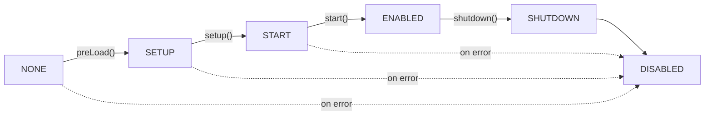

# Plugin Lifecycle

Understanding when and how your plugin code executes is essential for building reliable Hytale plugins. This guide covers the complete lifecycle from loading to shutdown, including best practices and IntelliJ integration tips.

<InfoBox type="tip" title="IntelliJ Integration">
Use the **`hyplugin`** live template in IntelliJ to quickly generate a complete plugin class with all lifecycle methods. Just type `hyplugin` and press Tab.
</InfoBox>

## Lifecycle Overview

Plugins transition through a series of states, each corresponding to a lifecycle method:



### Quick Reference

| Method | When Called | Purpose |
|--------|-------------|---------|
| **Constructor** | Plugin instantiation | Initialize fields, register configs with `withConfig()` |
| **preLoad()** | Before setup | Async config loading |
| **setup()** | After preLoad | Register commands, events, assets, systems |
| **start()** | After ALL plugins setup | Cross-plugin initialization |
| **shutdown()** | Server stopping | Cleanup resources, save data |

## Plugin States

Plugins transition through these states during their lifecycle:

| State | Description |
|-------|-------------|
| `NONE` | Initial state before any lifecycle method is called |
| `SETUP` | During `setup()` method execution |
| `START` | During `start()` method execution |
| `ENABLED` | Plugin is fully operational |
| `SHUTDOWN` | During `shutdown()` method execution |
| `DISABLED` | Plugin is disabled or failed to initialize |

```java
public enum PluginState {
   NONE,      // Initial state
   SETUP,     // During setup()
   START,     // During start()
   ENABLED,   // Fully operational
   SHUTDOWN,  // During shutdown()
   DISABLED;  // Disabled or failed
}
```

You can check the current state of your plugin:

```java
if (getState() == PluginState.ENABLED) {
    // Plugin is fully operational
}
```

## Lifecycle Methods in Detail

### Constructor

The constructor is called when the plugin is instantiated. Use it to:
- Initialize instance fields
- Register configuration files with `withConfig()`
- Set up singleton references if needed

```java
public class MyPlugin extends JavaPlugin {
    private Config<MyConfig> config;
    private static MyPlugin instance;

    public MyPlugin(@Nonnull JavaPluginInit init) {
        super(init);
        instance = this;

        // Register config for async loading in preLoad()
        config = withConfig(MyConfig.CODEC);
    }
}
```

<InfoBox type="warning" title="Important">
Do NOT register commands, events, or assets in the constructor. The registries are not ready yet. Use `setup()` instead.
</InfoBox>

### preLoad() (Optional)

The `preLoad()` method is called before `setup()` to asynchronously load configuration files. It returns a `CompletableFuture<Void>` that completes when all configs are loaded.

```java
@Override
@Nullable
public CompletableFuture<Void> preLoad() {
    // The base implementation loads all registered configs
    // Override only if you need custom async initialization
    return super.preLoad();
}
```

**Use cases:**
- Loading configuration files (handled automatically if you use `withConfig()`)
- Async initialization that must complete before setup
- Loading external resources

**What NOT to do:**
- Don't register commands, events, or assets here
- Don't interact with other plugins (they may not be loaded yet)

### setup()

The `setup()` method is the primary initialization method where you register all your plugin's functionality.

```java
@Override
protected void setup() {
    // Register commands
    getCommandRegistry().registerCommand(new MyCommand());

    // Register event listeners
    getEventRegistry().register(PlayerJoinEvent.class, this::onPlayerJoin);

    // Register ECS systems
    getEntityStoreRegistry().registerSystem(new MyEntitySystem());
    getChunkStoreRegistry().registerSystem(new MyChunkSystem());

    // Register assets
    getAssetRegistry().register(MyAsset.class, MyAsset.CODEC);

    // Log completion
    getLogger().info("Setup complete!");
}
```

<InfoBox type="tip" title="IntelliJ Integration">
Use these live templates to quickly add registrations:

- **`hyevent`** - Register an event listener
- **`hycmd`** - Register a command
- **`hyecs`** - Register an ECS system
- **`hylogger`** - Add a logger field
</InfoBox>

**Use cases:**
- Register commands with `getCommandRegistry()`
- Register event listeners with `getEventRegistry()`
- Register ECS systems for entities and chunks
- Register custom assets and codecs
- Initialize plugin-internal state

**What NOT to do:**
- Don't do heavy/blocking work - use async operations
- Don't interact with other plugins (use `start()` for that)
- Don't assume other plugins are ready

### start()

The `start()` method is called after ALL plugins have completed their `setup()` phase. This is the safe place to interact with other plugins.

```java
@Override
protected void start() {
    // Safe to interact with other plugins here
    OtherPlugin other = OtherPlugin.getInstance();
    if (other != null) {
        other.registerIntegration(this);
    }

    // Start any scheduled tasks
    getTaskRegistry().scheduleRepeating(this::tick, 20, 20); // Every second

    getLogger().info("Plugin started and ready!");
}
```

**Use cases:**
- Cross-plugin integration and API calls
- Starting scheduled tasks
- Initialization that depends on other plugins
- Sending startup messages

### shutdown()

The `shutdown()` method is called when the plugin is being disabled or the server is stopping.

```java
@Override
protected void shutdown() {
    // Save any pending data
    savePlayerData();

    // Cancel scheduled tasks (usually automatic)

    // Close external connections
    if (databaseConnection != null) {
        databaseConnection.close();
    }

    // Clean up resources
    cache.clear();

    getLogger().info("Plugin shut down gracefully");
}
```

**Use cases:**
- Save player data and world data
- Close database connections
- Release external resources
- Cancel any manual timers

<InfoBox type="info" title="Automatic Cleanup">
Registries (commands, events, tasks) are automatically cleaned up after `shutdown()`. You don't need to manually unregister them.
</InfoBox>

## Configuration Handling

Hytale provides a powerful async configuration system using codecs.

### Defining a Config Codec

```java
public class MyConfig {
    public static final BuilderCodec<MyConfig> CODEC = BuilderCodec.of(MyConfig::new)
        .with("welcomeMessage", MyConfig::getWelcomeMessage, MyConfig::setWelcomeMessage,
              Codec.STRING, "Welcome to the server!")
        .with("maxPlayers", MyConfig::getMaxPlayers, MyConfig::setMaxPlayers,
              Codec.INT, 100)
        .with("features", MyConfig::getFeatures, MyConfig::setFeatures,
              Codec.STRING.listOf(), List.of("feature1", "feature2"))
        .build();

    private String welcomeMessage;
    private int maxPlayers;
    private List<String> features;

    // Getters and setters...
    public String getWelcomeMessage() { return welcomeMessage; }
    public void setWelcomeMessage(String msg) { this.welcomeMessage = msg; }
    public int getMaxPlayers() { return maxPlayers; }
    public void setMaxPlayers(int max) { this.maxPlayers = max; }
    public List<String> getFeatures() { return features; }
    public void setFeatures(List<String> features) { this.features = features; }
}
```

### Registering and Using Config

```java
public class MyPlugin extends JavaPlugin {
    private Config<MyConfig> config;

    public MyPlugin(@Nonnull JavaPluginInit init) {
        super(init);
        // Register config - will be loaded automatically in preLoad()
        config = withConfig(MyConfig.CODEC);
    }

    @Override
    protected void setup() {
        // Config is now loaded and ready to use
        String welcome = config.get().getWelcomeMessage();
        getLogger().info("Welcome message: " + welcome);
    }
}
```

### Multiple Config Files

```java
public MyPlugin(@Nonnull JavaPluginInit init) {
    super(init);
    // Default "config.json"
    mainConfig = withConfig(MainConfig.CODEC);
    // Custom name "messages.json"
    messagesConfig = withConfig("messages", MessagesConfig.CODEC);
    // Another file "rewards.json"
    rewardsConfig = withConfig("rewards", RewardsConfig.CODEC);
}
```

## Available Registries

During `setup()`, you have access to these registries for registering your plugin's functionality:

| Registry | Method | Description |
|----------|--------|-------------|
| `CommandRegistry` | `getCommandRegistry()` | Register console and in-game commands |
| `EventRegistry` | `getEventRegistry()` | Subscribe to game events |
| `AssetRegistry` | `getAssetRegistry()` | Register custom assets and codecs |
| `BlockStateRegistry` | `getBlockStateRegistry()` | Register block states |
| `EntityRegistry` | `getEntityRegistry()` | Register entity types |
| `TaskRegistry` | `getTaskRegistry()` | Schedule repeating or delayed tasks |
| `ChunkStoreRegistry` | `getChunkStoreRegistry()` | Register ECS systems for chunks |
| `EntityStoreRegistry` | `getEntityStoreRegistry()` | Register ECS systems for entities |
| `ClientFeatureRegistry` | `getClientFeatureRegistry()` | Register client-side features |

### Command Registration

```java
@Override
protected void setup() {
    // Simple command
    getCommandRegistry().registerCommand(new TeleportCommand());

    // Command with subcommands
    getCommandRegistry().registerCommand(new AdminCommand());
}
```

### Event Registration

The `EventRegistry` supports multiple registration patterns:

```java
@Override
protected void setup() {
    EventRegistry events = getEventRegistry();

    // Default priority
    events.register(PlayerJoinEvent.class, this::onPlayerJoin);

    // Specified priority (EARLY, NORMAL, LATE)
    events.register(EventPriority.EARLY, PlayerChatEvent.class, this::onChat);

    // Global listener (receives ALL events of this type)
    events.registerGlobal(BlockBreakEvent.class, this::onAnyBlockBreak);

    // Async listener for non-blocking operations
    events.registerAsync(PlayerLoginEvent.class, this::onLoginAsync);
}

private void onPlayerJoin(PlayerJoinEvent event) {
    getLogger().info("Player joined: " + event.getPlayer().getName());
}

private CompletableFuture<PlayerLoginEvent> onLoginAsync(
        CompletableFuture<PlayerLoginEvent> eventFuture) {
    return eventFuture.thenApply(event -> {
        // Async processing
        return event;
    });
}
```

### Task Scheduling

```java
@Override
protected void start() {
    TaskRegistry tasks = getTaskRegistry();

    // Run once after delay (20 ticks = 1 second)
    tasks.scheduleDelayed(this::doOnce, 20);

    // Run repeatedly (initial delay, then every N ticks)
    tasks.scheduleRepeating(this::tick, 0, 20); // Every second

    // Run on next tick
    tasks.scheduleNextTick(this::immediate);
}
```

## Other Plugin APIs

### Logger Access

```java
// Get the plugin's logger
HytaleLogger logger = getLogger();

logger.info("Information message");
logger.warn("Warning message");
logger.error("Error message", exception);
logger.debug("Debug message"); // Only shown with debug enabled
```

<InfoBox type="tip" title="IntelliJ Integration">
Use the **`hylogger`** live template to quickly add a static logger field:

```java
private static final HytaleLogger LOGGER = HytaleLogger.forEnclosingClass();
```
</InfoBox>

### Data Directory

Each plugin gets its own data directory for storing files:

```java
Path dataDir = getDataDirectory();
// Example: mods/com.example_myplugin/

// Save custom data
Path customFile = dataDir.resolve("playerdata.json");
Files.writeString(customFile, jsonData);
```

### Manifest Access

```java
PluginManifest manifest = getManifest();
String name = manifest.getName();
String version = manifest.getVersion();
String group = manifest.getGroup();
```

### Plugin Identifier

```java
PluginIdentifier id = getIdentifier();
// Use for logging or cross-plugin communication
```

## Loading Process

The plugin loading process follows these phases:

1. **Discovery** - Plugins are discovered from:
   - Core plugins (built-in)
   - Builtin directory
   - Classpath (`manifest.json`/`manifests.json`)
   - The `mods` directory

2. **Dependency Validation** - Dependencies are validated against loaded plugins and server version requirements

3. **Load Order Calculation** - Plugins are sorted based on:
   - `dependencies` in manifest
   - `LoadBefore` declarations

4. **Instantiation** - Constructor is invoked with `JavaPluginInit`

5. **PreLoad** - `preLoad()` is called to load configs asynchronously

6. **Setup** - `setup()` is called to register functionality

7. **Start** - `start()` is called after all plugins are set up

## Constructor Requirement

All plugins must have a constructor that accepts a `JavaPluginInit` parameter:

```java
public class MyPlugin extends JavaPlugin {
    public MyPlugin(@Nonnull JavaPluginInit init) {
        super(init); // Required!
        // Your initialization...
    }
}
```

The server uses reflection to instantiate your plugin:

```java
Constructor<?> constructor = mainClass.getConstructor(JavaPluginInit.class);
JavaPluginInit init = new JavaPluginInit(manifest, dataDirectory, path, classLoader);
return (JavaPlugin) constructor.newInstance(init);
```

## Complete Plugin Example

Here's a comprehensive example showing all lifecycle methods and common patterns:

```java
package com.example.myplugin;

import com.hypixel.hytale.server.core.plugin.JavaPlugin;
import com.hypixel.hytale.server.core.plugin.JavaPluginInit;
import com.hypixel.hytale.server.core.plugin.Config;
import com.hypixel.hytale.server.core.logging.HytaleLogger;
import javax.annotation.Nonnull;
import javax.annotation.Nullable;
import java.util.concurrent.CompletableFuture;

public class MyPlugin extends JavaPlugin {
    private static final HytaleLogger LOGGER = HytaleLogger.forEnclosingClass();
    private static MyPlugin instance;

    private Config<MyConfig> config;
    private PlayerDataManager playerDataManager;

    // Singleton access for other plugins
    public static MyPlugin getInstance() {
        return instance;
    }

    public MyPlugin(@Nonnull JavaPluginInit init) {
        super(init);
        instance = this;

        // Register config for async loading
        config = withConfig(MyConfig.CODEC);
    }

    @Override
    @Nullable
    public CompletableFuture<Void> preLoad() {
        LOGGER.info("PreLoading configuration...");
        // Config files are loaded automatically
        return super.preLoad();
    }

    @Override
    protected void setup() {
        LOGGER.info("Setting up plugin...");

        // Initialize managers
        playerDataManager = new PlayerDataManager(getDataDirectory());

        // Register commands
        getCommandRegistry().registerCommand(new SpawnCommand());
        getCommandRegistry().registerCommand(new HomeCommand());

        // Register event listeners
        getEventRegistry().register(PlayerJoinEvent.class, this::onPlayerJoin);
        getEventRegistry().register(PlayerQuitEvent.class, this::onPlayerQuit);
        getEventRegistry().register(EventPriority.EARLY, PlayerChatEvent.class, this::onChat);

        // Register ECS systems
        getEntityStoreRegistry().registerSystem(new PlayerTrackingSystem());
        getChunkStoreRegistry().registerSystem(new CustomBlockSystem());

        LOGGER.info("Setup complete!");
    }

    @Override
    protected void start() {
        LOGGER.info("Starting plugin...");

        // Safe to interact with other plugins now
        EconomyPlugin economy = EconomyPlugin.getInstance();
        if (economy != null) {
            economy.registerCurrency("tokens", 0);
            LOGGER.info("Integrated with EconomyPlugin");
        }

        // Start scheduled tasks
        getTaskRegistry().scheduleRepeating(this::autoSave, 6000, 6000); // Every 5 minutes

        LOGGER.info("Plugin started! Welcome: " + config.get().getWelcomeMessage());
    }

    @Override
    protected void shutdown() {
        LOGGER.info("Shutting down...");

        // Save all player data
        if (playerDataManager != null) {
            playerDataManager.saveAll();
        }

        // Cleanup
        instance = null;

        LOGGER.info("Shutdown complete!");
    }

    // Event handlers
    private void onPlayerJoin(PlayerJoinEvent event) {
        Player player = event.getPlayer();
        playerDataManager.load(player);
        player.sendMessage(config.get().getWelcomeMessage());
    }

    private void onPlayerQuit(PlayerQuitEvent event) {
        playerDataManager.save(event.getPlayer());
    }

    private void onChat(PlayerChatEvent event) {
        // Early priority - can modify or cancel
        if (event.getMessage().contains("badword")) {
            event.setCancelled(true);
        }
    }

    private void autoSave() {
        playerDataManager.saveAll();
        LOGGER.debug("Auto-save complete");
    }

    // Public API for other plugins
    public MyConfig getConfiguration() {
        return config.get();
    }
}
```

## Real-World Examples

### BlockTickPlugin

This plugin demonstrates registering event listeners, systems, and codec types during `setup()`:

```java
public class BlockTickPlugin extends JavaPlugin implements IBlockTickProvider {
    private static BlockTickPlugin instance;

    public BlockTickPlugin(@Nonnull JavaPluginInit init) {
        super(init);
        instance = this;
    }

    @Override
    protected void setup() {
        // Register codec types
        TickProcedure.CODEC.register("BasicChance",
            BasicChanceBlockGrowthProcedure.class,
            BasicChanceBlockGrowthProcedure.CODEC);
        TickProcedure.CODEC.register("SplitChance",
            SplitChanceBlockGrowthProcedure.class,
            SplitChanceBlockGrowthProcedure.CODEC);

        // Register global event listener with early priority
        getEventRegistry().registerGlobal(EventPriority.EARLY,
            ChunkPreLoadProcessEvent.class, this::discoverTickingBlocks);

        // Register chunk systems
        ChunkStore.REGISTRY.registerSystem(new ChunkBlockTickSystem.PreTick());
        ChunkStore.REGISTRY.registerSystem(new ChunkBlockTickSystem.Ticking());
        ChunkStore.REGISTRY.registerSystem(new MergeWaitingBlocksSystem());

        // Set provider
        BlockTickManager.setBlockTickProvider(this);
    }
}
```

### BlockPhysicsPlugin

A simpler example showing event and system registration:

```java
public class BlockPhysicsPlugin extends JavaPlugin {
    public BlockPhysicsPlugin(@Nonnull JavaPluginInit init) {
        super(init);
    }

    @Override
    protected void setup() {
        // Validate prefabs when assets are loaded
        getEventRegistry().register(LoadAssetEvent.class,
            BlockPhysicsPlugin::validatePrefabs);

        // Register chunk physics system
        getChunkStoreRegistry().registerSystem(new BlockPhysicsSystems.Ticking());
    }

    private static void validatePrefabs(LoadAssetEvent event) {
        // Validation logic...
    }
}
```

## Best Practices

### Do's

1. **Register configs in the constructor** - Use `withConfig()` before `setup()` is called
2. **Use setup() for all registration** - Commands, events, assets, and systems
3. **Defer cross-plugin logic to start()** - Other plugins are guaranteed to be ready
4. **Clean up in shutdown()** - Save data, close connections, release resources
5. **Use the logger** - Consistent logging with `getLogger()`
6. **Check plugin state** - Verify `getState() == PluginState.ENABLED` before operations
7. **Handle errors gracefully** - Catch exceptions and log them

### Don'ts

1. **Don't do heavy work in setup()** - Use async operations for I/O
2. **Don't interact with other plugins in setup()** - Wait for `start()`
3. **Don't assume config is loaded in constructor** - Wait for `setup()`
4. **Don't manually unregister from registries** - It's automatic
5. **Don't ignore shutdown()** - Data loss can occur

### IntelliJ Tips Summary

| Template | Description |
|----------|-------------|
| `hyplugin` | Generate complete plugin class |
| `hyevent` | Register event listener |
| `hycmd` | Register command |
| `hyecs` | Register ECS system |
| `hylogger` | Add logger field |
| `hyconfig` | Generate config codec |

<InfoBox type="tip" title="Learn More">
Check out the [IntelliJ Plugin documentation](/docs/modding/plugins/intellij-plugin) for more live templates and development tools.
</InfoBox>
