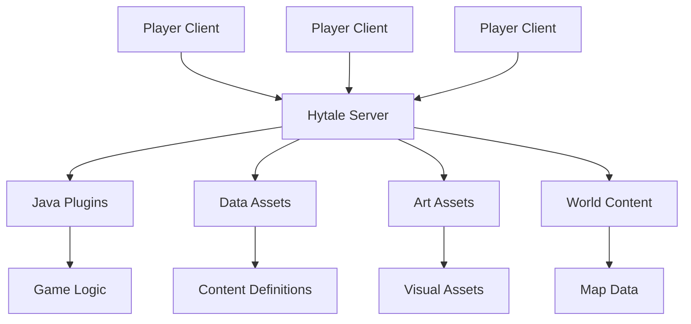

# Introduction to Hytale Development

Welcome to Hytale development! This guide will help you understand the fundamentals of creating content for Hytale.

## About Hytale

Hytale launched in Early Access on **January 13, 2026**, developed by Hypixel Studios - a team of over 50 developers led by original founders Simon Collins-Laflamme and Philippe Touchette, who reacquired the project from Riot Games in November 2025.

### Availability

- **Platforms:** Windows, macOS (M1+ with macOS Tahoe), and Linux (native Flatpak)
- **Distribution:** Available exclusively via the official launcher at [hytale.com](https://hytale.com) (not on Steam)
- **Pricing:** Standard ($19.99), Supporter ($34.99), Cursebreaker Founders ($69.99)
- **Players:** Over 1 million players expected at launch
- **Development:** 2 years of development funded by pre-orders

## Why Mod Hytale?

Hytale was designed from the ground up with modding at its core. Unlike many games where modding is an afterthought, Hytale provides:

- **Native mod support** - No hacks or workarounds needed
- **Server-side execution** - All mods run on the server
- **Seamless player experience** - Players don't need to download anything
- **Professional tools** - The same tools used by Hypixel Studios

## Types of Modifications

Hytale offers four main categories of modifications:

### 1. Java Plugins

Full-featured plugins written in Java, similar to Bukkit/Spigot plugins:

```java
@PluginInfo(name = "MyPlugin", version = "1.0.0")
public class MyPlugin extends Plugin {
    @Override
    public void onEnable() {
        getLogger().info("Plugin enabled!");
    }
}
```

**Best for:** Complex game logic, custom commands, economy systems

### 2. Data Assets (JSON)

JSON configuration files that define game content without programming:

```json
{
  "id": "my_custom_block",
  "displayName": "Ruby Block",
  "properties": {
    "hardness": 3.0,
    "resistance": 5.0
  }
}
```

**Best for:** New blocks, items, NPCs, loot tables

### 3. Art Assets

Custom 3D models, textures, and animations:

- Models (`.blockymodel`)
- Animations (`.blockyanim`)
- Textures (PNG)
- Sounds

**Best for:** Custom creatures, items, decorations

### 4. World Content

Pre-built structures and world configurations:

- Prefabs (reusable structures)
- Custom biomes
- Terrain modifications

## Architecture Overview



### Server-First Philosophy

All modifications in Hytale execute on the server:

- Players connect with an unmodified client
- The server streams all necessary content
- No mod installation required for players
- Switching servers is seamless

## Next Steps

Ready to start? Follow these guides in order:

1. [**Prerequisites**](/docs/getting-started/prerequisites) - What you need installed
2. [**Environment Setup**](/docs/getting-started/environment-setup) - Configure your development tools
3. [**Your First Mod**](/docs/getting-started/first-mod) - Create a simple mod

## Useful Resources

- [Official Hytale Blog](https://hytale.com/news)
- [HytaleModding.dev](https://hytalemodding.dev)
- [Blockbench](https://www.blockbench.net/) - 3D modeling tool
- [Hytale Discord](https://discord.gg/hytale)
