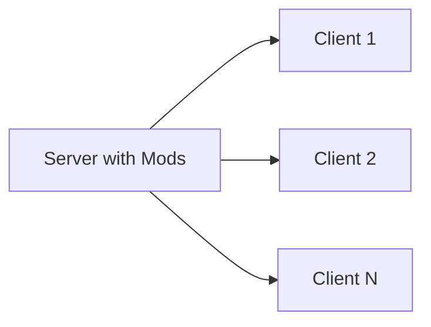

# Modding Architecture

Hytale uses a unique **server-first architecture** for all modifications.

## Server-Side Execution

All mods execute on the server:

### Benefits

- Players don't install mods
- Seamless server switching
- Enhanced security
- Instant mod updates

## How It Works

1. Player connects to server
2. Server streams required assets
3. Client renders content
4. All logic runs server-side

## Types of Mods

Hytale supports three distinct mod types, each targeting different skill levels:

| Type | Description | Required Skills |
|------|-------------|-----------------|
| **Packs** | Asset packs for new blocks, mobs, items | No code - Asset Editor only |
| **Plugins** | Java mods using the game API | Java programming |
| **Bootstrap Plugins** | Low-level plugins for bytecode transformation | Advanced Java |

## Languages and Scripting

### Official Position

Hypixel Studios has officially decided **not to support Lua or Python** for modding. Instead, the following options are available:

- **Visual Scripting** via Node Editor (inspired by Unreal Engine Blueprints)
- **Asset Graph Editor** integrated with real-time reloading
- **Java Plugins** requiring Java 25 (Adoptium recommended)

### Server Source Code

The server source code is planned to be released **1-2 months after launch**, giving developers full insight into the game's internals.

## Development Tools

### Official Tools

| Tool | Purpose | Status |
|------|---------|--------|
| **Hytale Asset Editor** | Main editor for data assets | Available |
| **Hytale Node Editor** | Visual scripts for brushes and world gen | Available |
| **Blockbench Plugin** | Create 3D models and animations | Available |
| **Machinima** | Content recording | Available |
| **World Tools** | World modification/editing | Available |

### Blockbench Plugin

The Blockbench plugin replaces the old Hytale Model Maker:

- **Formats:** `.blockymodel` and `.blockyanim`
- **GitHub:** [https://github.com/JannisX11/hytale-blockbench-plugin](https://github.com/JannisX11/hytale-blockbench-plugin)

## File Formats

| Type | Format |
|------|--------|
| Data Assets | JSON |
| Models | `.blockymodel` |
| Animations | `.blockyanim` |
| Plugins | `.jar` |
| Configuration | `config.json`, `permissions.json` |

## Distribution

**CurseForge** is the official distribution partner (since January 5, 2026):

- **0% commission** on mods and servers during the first 2 years
- Official platform for discovering and sharing content

## Implications for Developers

- Design with server performance in mind
- Optimize asset sizes
- Implement validation server-side
- Test with multiple concurrent players

## Next Steps

- [Data Assets](/docs/modding/data-assets/overview)
- [Java Plugins](/docs/modding/plugins/overview)
