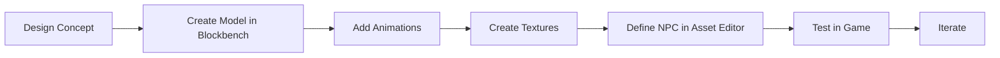

# Development Tools Overview

Hytale provides a comprehensive suite of tools for content creation, from 3D modeling to in-game editing. According to the official [Modding Strategy](https://hytale.com/news/2025/11/hytale-modding-strategy-and-status), Hypixel Studios aims to provide the same tools internally used by the development team.

## In-Game Tools

Hytale includes several powerful tools built directly into the game, allowing creators to modify and create content without leaving the game environment.

### Asset Editor

The primary editor for data assets, allowing you to modify Packs without any coding.

**Features:**
- Edit blocks, items, NPCs and other game content
- Graphical interface for modifying Packs without coding
- Hot reloading - see changes instantly in-game
- No programming knowledge required

**Limitations:**
- Some asset types not yet fully supported
- NPC and world generation editors still being improved

[Asset Editor Guide](/docs/tools/asset-editor/overview)

### World Tools

Tools for modifying and editing worlds directly in-game.

**Features:**
- Terrain modification
- World editing capabilities
- Integration with Creative Mode

### Visual Scripting

A visual scripting system inspired by Unreal Engine's Blueprints.

**Features:**
- Node-based programming without writing code
- Create custom behaviors and game logic
- Accessible to non-programmers

### Node Editor

Node-based editor for brushes and world generation systems.

**Features:**
- Visual graph editing for complex systems
- Create custom world generation rules
- Design scripted brushes

:::note In Development
The Node Editor is currently described as "not polished" but functional. It will be improved over time.
:::

### Scripted Brushes

Procedural brushes for creating terrain and structures.

**Examples:**
- Mountain generation
- Path creation
- Ruins and structure placement
- Custom procedural content

### Selection Tool

Advanced selection tool for world editing.

**Features:**
- Select regions in 3D space
- Copy, paste, and manipulate selections
- Works with other world editing tools

### Prefabs

Pre-built reusable structures.

**Features:**
- Save and load custom structures
- Share prefabs between worlds
- Edit prefabs in a separate environment
- Over 100+ prefab models available

### Machinima Tools

Create cinematics and videos with keyframe-based camera animation.

**Features:**
- **Camera Actor**: Create camera entities with keyframe animation
- Define trajectories, speeds, and custom behaviors
- Create cinematic sequences for trailers and content

> "The Machinima Tools have many more features not displayed in quick demos, and they are scheduled for a massive upgrade in functionality and user experience in the coming months after launch."
> -- [Hytale Creative Mode](https://hytale.com/news/2025/11/hytale-creative-mode)

[Machinima Guide](/docs/tools/machinima)

## Creative Mode

Available at launch, Creative Mode provides access to all creation tools.

> "By swapping to Creative Mode in your world, you can fly around and explore, create, edit, make things explode, and more."
> -- Ktar, Creative Mode Engineer

**Features:**
- Unlimited access to all blocks
- Advanced building tools
- Character model changer (100+ NPC models)
- All creation tools available
- **Paintbrush**: Paint shapes (pyramids, cones, squares) with customizable materials, density, and masks
- **Prefab System**: Load and edit prefabs in a separate editing environment
- **Customizable Flight**: Adjust speed, controls, flight mode (hover/directional), and inertia
- Selection and copy/paste

[Creative Mode Guide](/docs/tools/creative-mode)

## External Tools

### Blockbench + Hytale Plugin

The official tool for creating 3D models and animations. Blockbench replaces the internal "Hytale Model Maker" tool to better support established creative workflows in the community.

> "We officially support Blockbench for creating Hytale models, textures, and animations."
> -- [Hytale Modding Strategy](https://hytale.com/news/2025/11/hytale-modding-strategy-and-status)

**Features:**
- Create `.blockymodel` files with consistent pixel ratios
- Animate with `.blockyanim` format
- Bone hierarchy support
- Live export to Hytale-compatible formats
- Quality-of-life improvements for Hytale workflow

**Installation:**
1. Download [Blockbench](https://www.blockbench.net/)
2. Install the [Hytale plugin](https://github.com/JannisX11/hytale-blockbench-plugin) from the plugin manager

**Official Resources:**
- [An Introduction to Making Models for Hytale](https://hytale.com/news/2025/12/an-introduction-to-making-models-for-hytale)
- [GitHub Repository](https://github.com/JannisX11/hytale-blockbench-plugin)

[Blockbench Guide](/docs/tools/blockbench/installation)

### IDE Recommendations

| IDE | Best For | Cost |
|-----|----------|------|
| IntelliJ IDEA | Java plugins | Free (Community) |
| VS Code | JSON editing, general | Free |
| Eclipse | Java plugins | Free |

### Version Control

Use Git for managing your projects:

```bash
git init
git add .
git commit -m "Initial commit"
```

### Image Editors

For texture creation:

- [GIMP](https://www.gimp.org/) - Free, full-featured
- [Aseprite](https://www.aseprite.org/) - Pixel art focused
- Photoshop - Industry standard

## Tool Comparison

| Task | Recommended Tool |
|------|-----------------|
| 3D Models | Blockbench |
| Animations | Blockbench |
| Textures | GIMP / Photoshop |
| JSON Data | Asset Editor / VS Code |
| Java Plugins | IntelliJ IDEA |
| World Building | Creative Mode + World Tools |
| Visual Scripting | In-game Visual Scripting |
| Cinematics | Machinima Tools |

## Workflow Example

Creating a custom creature:



## File Formats

| Format | Purpose | Tool |
|--------|---------|------|
| `.blockymodel` | 3D models | Blockbench |
| `.blockyanim` | Animations | Blockbench |
| `.json` | Data assets | Asset Editor |
| `.png` | Textures | Image editor |
| `.jar` | Java plugins | IDE |

## Getting Started

<div className="doc-card-grid">
  <DocCard item={{
    type: 'link',
    label: 'Blockbench Setup',
    href: '/docs/tools/blockbench/installation',
    description: 'Install and configure Blockbench'
  }} />
  <DocCard item={{
    type: 'link',
    label: 'Asset Editor',
    href: '/docs/tools/asset-editor/overview',
    description: 'Learn the built-in editor'
  }} />
  <DocCard item={{
    type: 'link',
    label: 'Creative Mode',
    href: '/docs/tools/creative-mode',
    description: 'World building tools'
  }} />
</div>
