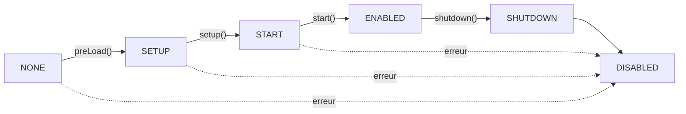

# Cycle de vie des plugins

Comprendre quand et comment le code de votre plugin s'execute est essentiel pour creer des plugins Hytale fiables. Ce guide couvre le cycle de vie complet, du chargement a l'arret, incluant les bonnes pratiques et les astuces d'integration IntelliJ.

<InfoBox type="tip" title="Integration IntelliJ">
Utilisez le modele **`hyplugin`** dans IntelliJ pour generer rapidement une classe de plugin complete avec toutes les methodes du cycle de vie. Tapez simplement `hyplugin` et appuyez sur Tab.
</InfoBox>

## Apercu du cycle de vie

Les plugins passent par une serie d'etats, chacun correspondant a une methode du cycle de vie :



### Reference rapide

| Methode | Quand appelee | Objectif |
|---------|---------------|----------|
| **Constructeur** | Instanciation du plugin | Initialiser les champs, enregistrer les configs avec `withConfig()` |
| **preLoad()** | Avant setup | Chargement asynchrone des configs |
| **setup()** | Apres preLoad | Enregistrer commandes, evenements, assets, systemes |
| **start()** | Apres setup de TOUS les plugins | Initialisation inter-plugins |
| **shutdown()** | Arret du serveur | Nettoyage des ressources, sauvegarde des donnees |

## Etats des plugins

Les plugins passent par ces etats au cours de leur cycle de vie :

| Etat | Description |
|------|-------------|
| `NONE` | Etat initial avant l'appel de toute methode du cycle de vie |
| `SETUP` | Pendant l'execution de la methode `setup()` |
| `START` | Pendant l'execution de la methode `start()` |
| `ENABLED` | Le plugin est entierement operationnel |
| `SHUTDOWN` | Pendant l'execution de la methode `shutdown()` |
| `DISABLED` | Le plugin est desactive ou n'a pas reussi a s'initialiser |

```java
public enum PluginState {
   NONE,      // Etat initial
   SETUP,     // Pendant setup()
   START,     // Pendant start()
   ENABLED,   // Entierement operationnel
   SHUTDOWN,  // Pendant shutdown()
   DISABLED;  // Desactive ou echec
}
```

Vous pouvez verifier l'etat actuel de votre plugin :

```java
if (getState() == PluginState.ENABLED) {
    // Le plugin est entierement operationnel
}
```

## Methodes du cycle de vie en detail

### Constructeur

Le constructeur est appele lorsque le plugin est instancie. Utilisez-le pour :
- Initialiser les champs d'instance
- Enregistrer les fichiers de configuration avec `withConfig()`
- Configurer les references singleton si necessaire

```java
public class MyPlugin extends JavaPlugin {
    private Config<MyConfig> config;
    private static MyPlugin instance;

    public MyPlugin(@Nonnull JavaPluginInit init) {
        super(init);
        instance = this;

        // Enregistrer la config pour le chargement asynchrone dans preLoad()
        config = withConfig(MyConfig.CODEC);
    }
}
```

<InfoBox type="warning" title="Important">
N'enregistrez PAS les commandes, evenements ou assets dans le constructeur. Les registres ne sont pas encore prets. Utilisez `setup()` a la place.
</InfoBox>

### preLoad() (Optionnel)

La methode `preLoad()` est appelee avant `setup()` pour charger de maniere asynchrone les fichiers de configuration. Elle retourne un `CompletableFuture<Void>` qui se termine lorsque toutes les configs sont chargees.

```java
@Override
@Nullable
public CompletableFuture<Void> preLoad() {
    // L'implementation de base charge toutes les configs enregistrees
    // Surchargez uniquement si vous avez besoin d'une initialisation asynchrone personnalisee
    return super.preLoad();
}
```

**Cas d'utilisation :**
- Chargement des fichiers de configuration (gere automatiquement si vous utilisez `withConfig()`)
- Initialisation asynchrone qui doit se terminer avant setup
- Chargement de ressources externes

**A ne pas faire :**
- N'enregistrez pas les commandes, evenements ou assets ici
- N'interagissez pas avec d'autres plugins (ils peuvent ne pas etre encore charges)

### setup()

La methode `setup()` est la methode d'initialisation principale ou vous enregistrez toutes les fonctionnalites de votre plugin.

```java
@Override
protected void setup() {
    // Enregistrer les commandes
    getCommandRegistry().registerCommand(new MyCommand());

    // Enregistrer les ecouteurs d'evenements
    getEventRegistry().register(PlayerJoinEvent.class, this::onPlayerJoin);

    // Enregistrer les systemes ECS
    getEntityStoreRegistry().registerSystem(new MyEntitySystem());
    getChunkStoreRegistry().registerSystem(new MyChunkSystem());

    // Enregistrer les assets
    getAssetRegistry().register(MyAsset.class, MyAsset.CODEC);

    // Logger la completion
    getLogger().info("Configuration terminee !");
}
```

<InfoBox type="tip" title="Integration IntelliJ">
Utilisez ces modeles pour ajouter rapidement des enregistrements :

- **`hyevent`** - Enregistrer un ecouteur d'evenement
- **`hycmd`** - Enregistrer une commande
- **`hyecs`** - Enregistrer un systeme ECS
- **`hylogger`** - Ajouter un champ logger
</InfoBox>

**Cas d'utilisation :**
- Enregistrer les commandes avec `getCommandRegistry()`
- Enregistrer les ecouteurs d'evenements avec `getEventRegistry()`
- Enregistrer les systemes ECS pour les entites et les chunks
- Enregistrer les assets personnalises et les codecs
- Initialiser l'etat interne du plugin

**A ne pas faire :**
- Ne faites pas de travail lourd/bloquant - utilisez des operations asynchrones
- N'interagissez pas avec d'autres plugins (utilisez `start()` pour cela)
- Ne supposez pas que les autres plugins sont prets

### start()

La methode `start()` est appelee apres que TOUS les plugins ont termine leur phase `setup()`. C'est l'endroit sur pour interagir avec d'autres plugins.

```java
@Override
protected void start() {
    // Il est sur d'interagir avec d'autres plugins maintenant
    OtherPlugin other = OtherPlugin.getInstance();
    if (other != null) {
        other.registerIntegration(this);
    }

    // Demarrer les taches planifiees
    getTaskRegistry().scheduleRepeating(this::tick, 20, 20); // Chaque seconde

    getLogger().info("Plugin demarre et pret !");
}
```

**Cas d'utilisation :**
- Integration et appels API inter-plugins
- Demarrage des taches planifiees
- Initialisation dependant d'autres plugins
- Envoi de messages de demarrage

### shutdown()

La methode `shutdown()` est appelee lorsque le plugin est desactive ou que le serveur s'arrete.

```java
@Override
protected void shutdown() {
    // Sauvegarder les donnees en attente
    savePlayerData();

    // Annuler les taches planifiees (generalement automatique)

    // Fermer les connexions externes
    if (databaseConnection != null) {
        databaseConnection.close();
    }

    // Liberer les ressources
    cache.clear();

    getLogger().info("Plugin arrete correctement");
}
```

**Cas d'utilisation :**
- Sauvegarder les donnees des joueurs et du monde
- Fermer les connexions a la base de donnees
- Liberer les ressources externes
- Annuler les timers manuels

<InfoBox type="info" title="Nettoyage automatique">
Les registres (commandes, evenements, taches) sont automatiquement nettoyes apres `shutdown()`. Vous n'avez pas besoin de les desenregistrer manuellement.
</InfoBox>

## Gestion de la configuration

Hytale fournit un systeme de configuration asynchrone puissant utilisant les codecs.

### Definir un codec de configuration

```java
public class MyConfig {
    public static final BuilderCodec<MyConfig> CODEC = BuilderCodec.of(MyConfig::new)
        .with("welcomeMessage", MyConfig::getWelcomeMessage, MyConfig::setWelcomeMessage,
              Codec.STRING, "Bienvenue sur le serveur !")
        .with("maxPlayers", MyConfig::getMaxPlayers, MyConfig::setMaxPlayers,
              Codec.INT, 100)
        .with("features", MyConfig::getFeatures, MyConfig::setFeatures,
              Codec.STRING.listOf(), List.of("feature1", "feature2"))
        .build();

    private String welcomeMessage;
    private int maxPlayers;
    private List<String> features;

    // Getters et setters...
    public String getWelcomeMessage() { return welcomeMessage; }
    public void setWelcomeMessage(String msg) { this.welcomeMessage = msg; }
    public int getMaxPlayers() { return maxPlayers; }
    public void setMaxPlayers(int max) { this.maxPlayers = max; }
    public List<String> getFeatures() { return features; }
    public void setFeatures(List<String> features) { this.features = features; }
}
```

### Enregistrer et utiliser la configuration

```java
public class MyPlugin extends JavaPlugin {
    private Config<MyConfig> config;

    public MyPlugin(@Nonnull JavaPluginInit init) {
        super(init);
        // Enregistrer la config - sera chargee automatiquement dans preLoad()
        config = withConfig(MyConfig.CODEC);
    }

    @Override
    protected void setup() {
        // La config est maintenant chargee et prete a etre utilisee
        String welcome = config.get().getWelcomeMessage();
        getLogger().info("Message de bienvenue : " + welcome);
    }
}
```

### Fichiers de configuration multiples

```java
public MyPlugin(@Nonnull JavaPluginInit init) {
    super(init);
    // Par defaut "config.json"
    mainConfig = withConfig(MainConfig.CODEC);
    // Nom personnalise "messages.json"
    messagesConfig = withConfig("messages", MessagesConfig.CODEC);
    // Autre fichier "rewards.json"
    rewardsConfig = withConfig("rewards", RewardsConfig.CODEC);
}
```

## Registres disponibles

Pendant `setup()`, vous avez acces a ces registres pour enregistrer les fonctionnalites de votre plugin :

| Registre | Methode | Description |
|----------|---------|-------------|
| `CommandRegistry` | `getCommandRegistry()` | Enregistrer les commandes de console et en jeu |
| `EventRegistry` | `getEventRegistry()` | S'abonner aux evenements du jeu |
| `AssetRegistry` | `getAssetRegistry()` | Enregistrer des assets et codecs personnalises |
| `BlockStateRegistry` | `getBlockStateRegistry()` | Enregistrer les etats de blocs |
| `EntityRegistry` | `getEntityRegistry()` | Enregistrer les types d'entites |
| `TaskRegistry` | `getTaskRegistry()` | Planifier des taches repetees ou differees |
| `ChunkStoreRegistry` | `getChunkStoreRegistry()` | Enregistrer les systemes ECS pour les chunks |
| `EntityStoreRegistry` | `getEntityStoreRegistry()` | Enregistrer les systemes ECS pour les entites |
| `ClientFeatureRegistry` | `getClientFeatureRegistry()` | Enregistrer les fonctionnalites cote client |

### Enregistrement des commandes

```java
@Override
protected void setup() {
    // Commande simple
    getCommandRegistry().registerCommand(new TeleportCommand());

    // Commande avec sous-commandes
    getCommandRegistry().registerCommand(new AdminCommand());
}
```

### Enregistrement des evenements

Le `EventRegistry` supporte plusieurs modeles d'enregistrement :

```java
@Override
protected void setup() {
    EventRegistry events = getEventRegistry();

    // Priorite par defaut
    events.register(PlayerJoinEvent.class, this::onPlayerJoin);

    // Priorite specifiee (EARLY, NORMAL, LATE)
    events.register(EventPriority.EARLY, PlayerChatEvent.class, this::onChat);

    // Ecouteur global (recoit TOUS les evenements de ce type)
    events.registerGlobal(BlockBreakEvent.class, this::onAnyBlockBreak);

    // Ecouteur asynchrone pour les operations non bloquantes
    events.registerAsync(PlayerLoginEvent.class, this::onLoginAsync);
}

private void onPlayerJoin(PlayerJoinEvent event) {
    getLogger().info("Joueur connecte : " + event.getPlayer().getName());
}

private CompletableFuture<PlayerLoginEvent> onLoginAsync(
        CompletableFuture<PlayerLoginEvent> eventFuture) {
    return eventFuture.thenApply(event -> {
        // Traitement asynchrone
        return event;
    });
}
```

### Planification des taches

```java
@Override
protected void start() {
    TaskRegistry tasks = getTaskRegistry();

    // Executer une fois apres un delai (20 ticks = 1 seconde)
    tasks.scheduleDelayed(this::doOnce, 20);

    // Executer de maniere repetee (delai initial, puis toutes les N ticks)
    tasks.scheduleRepeating(this::tick, 0, 20); // Chaque seconde

    // Executer au prochain tick
    tasks.scheduleNextTick(this::immediate);
}
```

## Autres API des plugins

### Acces au logger

```java
// Obtenir le logger du plugin
HytaleLogger logger = getLogger();

logger.info("Message d'information");
logger.warn("Message d'avertissement");
logger.error("Message d'erreur", exception);
logger.debug("Message de debug"); // Affiche uniquement avec le debug active
```

<InfoBox type="tip" title="Integration IntelliJ">
Utilisez le modele **`hylogger`** pour ajouter rapidement un champ logger statique :

```java
private static final HytaleLogger LOGGER = HytaleLogger.forEnclosingClass();
```
</InfoBox>

### Repertoire de donnees

Chaque plugin obtient son propre repertoire de donnees pour stocker des fichiers :

```java
Path dataDir = getDataDirectory();
// Exemple : mods/com.example_myplugin/

// Sauvegarder des donnees personnalisees
Path customFile = dataDir.resolve("playerdata.json");
Files.writeString(customFile, jsonData);
```

### Acces au manifeste

```java
PluginManifest manifest = getManifest();
String name = manifest.getName();
String version = manifest.getVersion();
String group = manifest.getGroup();
```

### Identifiant du plugin

```java
PluginIdentifier id = getIdentifier();
// Utiliser pour le logging ou la communication inter-plugins
```

## Processus de chargement

Le processus de chargement des plugins suit ces phases :

1. **Decouverte** - Les plugins sont decouverts depuis :
   - Les plugins de base (integres)
   - Le repertoire builtin
   - Le classpath (`manifest.json`/`manifests.json`)
   - Le repertoire `mods`

2. **Validation des dependances** - Les dependances sont validees par rapport aux plugins charges et aux exigences de version du serveur

3. **Calcul de l'ordre de chargement** - Les plugins sont tries en fonction de :
   - `dependencies` dans le manifeste
   - Declarations `LoadBefore`

4. **Instanciation** - Le constructeur est invoque avec `JavaPluginInit`

5. **PreLoad** - `preLoad()` est appele pour charger les configs de maniere asynchrone

6. **Setup** - `setup()` est appele pour enregistrer les fonctionnalites

7. **Start** - `start()` est appele apres que tous les plugins sont configures

## Exigence du constructeur

Tous les plugins doivent avoir un constructeur qui accepte un parametre `JavaPluginInit` :

```java
public class MyPlugin extends JavaPlugin {
    public MyPlugin(@Nonnull JavaPluginInit init) {
        super(init); // Obligatoire !
        // Votre initialisation...
    }
}
```

Le serveur utilise la reflexion pour instancier votre plugin :

```java
Constructor<?> constructor = mainClass.getConstructor(JavaPluginInit.class);
JavaPluginInit init = new JavaPluginInit(manifest, dataDirectory, path, classLoader);
return (JavaPlugin) constructor.newInstance(init);
```

## Exemple complet de plugin

Voici un exemple complet montrant toutes les methodes du cycle de vie et les patterns courants :

```java
package com.example.myplugin;

import com.hypixel.hytale.server.core.plugin.JavaPlugin;
import com.hypixel.hytale.server.core.plugin.JavaPluginInit;
import com.hypixel.hytale.server.core.plugin.Config;
import com.hypixel.hytale.server.core.logging.HytaleLogger;
import javax.annotation.Nonnull;
import javax.annotation.Nullable;
import java.util.concurrent.CompletableFuture;

public class MyPlugin extends JavaPlugin {
    private static final HytaleLogger LOGGER = HytaleLogger.forEnclosingClass();
    private static MyPlugin instance;

    private Config<MyConfig> config;
    private PlayerDataManager playerDataManager;

    // Acces singleton pour les autres plugins
    public static MyPlugin getInstance() {
        return instance;
    }

    public MyPlugin(@Nonnull JavaPluginInit init) {
        super(init);
        instance = this;

        // Enregistrer la config pour le chargement asynchrone
        config = withConfig(MyConfig.CODEC);
    }

    @Override
    @Nullable
    public CompletableFuture<Void> preLoad() {
        LOGGER.info("Prechargement de la configuration...");
        // Les fichiers de config sont charges automatiquement
        return super.preLoad();
    }

    @Override
    protected void setup() {
        LOGGER.info("Configuration du plugin...");

        // Initialiser les gestionnaires
        playerDataManager = new PlayerDataManager(getDataDirectory());

        // Enregistrer les commandes
        getCommandRegistry().registerCommand(new SpawnCommand());
        getCommandRegistry().registerCommand(new HomeCommand());

        // Enregistrer les ecouteurs d'evenements
        getEventRegistry().register(PlayerJoinEvent.class, this::onPlayerJoin);
        getEventRegistry().register(PlayerQuitEvent.class, this::onPlayerQuit);
        getEventRegistry().register(EventPriority.EARLY, PlayerChatEvent.class, this::onChat);

        // Enregistrer les systemes ECS
        getEntityStoreRegistry().registerSystem(new PlayerTrackingSystem());
        getChunkStoreRegistry().registerSystem(new CustomBlockSystem());

        LOGGER.info("Configuration terminee !");
    }

    @Override
    protected void start() {
        LOGGER.info("Demarrage du plugin...");

        // Il est sur d'interagir avec d'autres plugins maintenant
        EconomyPlugin economy = EconomyPlugin.getInstance();
        if (economy != null) {
            economy.registerCurrency("tokens", 0);
            LOGGER.info("Integration avec EconomyPlugin effectuee");
        }

        // Demarrer les taches planifiees
        getTaskRegistry().scheduleRepeating(this::autoSave, 6000, 6000); // Toutes les 5 minutes

        LOGGER.info("Plugin demarre ! Bienvenue : " + config.get().getWelcomeMessage());
    }

    @Override
    protected void shutdown() {
        LOGGER.info("Arret en cours...");

        // Sauvegarder toutes les donnees des joueurs
        if (playerDataManager != null) {
            playerDataManager.saveAll();
        }

        // Nettoyage
        instance = null;

        LOGGER.info("Arret termine !");
    }

    // Gestionnaires d'evenements
    private void onPlayerJoin(PlayerJoinEvent event) {
        Player player = event.getPlayer();
        playerDataManager.load(player);
        player.sendMessage(config.get().getWelcomeMessage());
    }

    private void onPlayerQuit(PlayerQuitEvent event) {
        playerDataManager.save(event.getPlayer());
    }

    private void onChat(PlayerChatEvent event) {
        // Priorite early - peut modifier ou annuler
        if (event.getMessage().contains("motinterdit")) {
            event.setCancelled(true);
        }
    }

    private void autoSave() {
        playerDataManager.saveAll();
        LOGGER.debug("Sauvegarde automatique terminee");
    }

    // API publique pour les autres plugins
    public MyConfig getConfiguration() {
        return config.get();
    }
}
```

## Exemples concrets

### BlockTickPlugin

Ce plugin demontre l'enregistrement d'ecouteurs d'evenements, de systemes et de types de codec pendant `setup()` :

```java
public class BlockTickPlugin extends JavaPlugin implements IBlockTickProvider {
    private static BlockTickPlugin instance;

    public BlockTickPlugin(@Nonnull JavaPluginInit init) {
        super(init);
        instance = this;
    }

    @Override
    protected void setup() {
        // Enregistrer les types de codec
        TickProcedure.CODEC.register("BasicChance",
            BasicChanceBlockGrowthProcedure.class,
            BasicChanceBlockGrowthProcedure.CODEC);
        TickProcedure.CODEC.register("SplitChance",
            SplitChanceBlockGrowthProcedure.class,
            SplitChanceBlockGrowthProcedure.CODEC);

        // Enregistrer un ecouteur d'evenement global avec priorite early
        getEventRegistry().registerGlobal(EventPriority.EARLY,
            ChunkPreLoadProcessEvent.class, this::discoverTickingBlocks);

        // Enregistrer les systemes de chunk
        ChunkStore.REGISTRY.registerSystem(new ChunkBlockTickSystem.PreTick());
        ChunkStore.REGISTRY.registerSystem(new ChunkBlockTickSystem.Ticking());
        ChunkStore.REGISTRY.registerSystem(new MergeWaitingBlocksSystem());

        // Definir le fournisseur
        BlockTickManager.setBlockTickProvider(this);
    }
}
```

### BlockPhysicsPlugin

Un exemple plus simple montrant l'enregistrement d'evenements et de systemes :

```java
public class BlockPhysicsPlugin extends JavaPlugin {
    public BlockPhysicsPlugin(@Nonnull JavaPluginInit init) {
        super(init);
    }

    @Override
    protected void setup() {
        // Valider les prefabs quand les assets sont charges
        getEventRegistry().register(LoadAssetEvent.class,
            BlockPhysicsPlugin::validatePrefabs);

        // Enregistrer le systeme de physique des chunks
        getChunkStoreRegistry().registerSystem(new BlockPhysicsSystems.Ticking());
    }

    private static void validatePrefabs(LoadAssetEvent event) {
        // Logique de validation...
    }
}
```

## Bonnes pratiques

### A faire

1. **Enregistrez les configs dans le constructeur** - Utilisez `withConfig()` avant l'appel de `setup()`
2. **Utilisez setup() pour tous les enregistrements** - Commandes, evenements, assets et systemes
3. **Differez la logique inter-plugins a start()** - Les autres plugins sont garantis d'etre prets
4. **Nettoyez dans shutdown()** - Sauvegardez les donnees, fermez les connexions, liberez les ressources
5. **Utilisez le logger** - Journalisation coherente avec `getLogger()`
6. **Verifiez l'etat du plugin** - Verifiez `getState() == PluginState.ENABLED` avant les operations
7. **Gerez les erreurs correctement** - Capturez les exceptions et loggez-les

### A eviter

1. **Ne faites pas de travail lourd dans setup()** - Utilisez des operations asynchrones pour les I/O
2. **N'interagissez pas avec d'autres plugins dans setup()** - Attendez `start()`
3. **Ne supposez pas que la config est chargee dans le constructeur** - Attendez `setup()`
4. **Ne desenregistrez pas manuellement des registres** - C'est automatique
5. **N'ignorez pas shutdown()** - Une perte de donnees peut survenir

### Resume des astuces IntelliJ

| Modele | Description |
|--------|-------------|
| `hyplugin` | Generer une classe de plugin complete |
| `hyevent` | Enregistrer un ecouteur d'evenement |
| `hycmd` | Enregistrer une commande |
| `hyecs` | Enregistrer un systeme ECS |
| `hylogger` | Ajouter un champ logger |
| `hyconfig` | Generer un codec de configuration |

<InfoBox type="tip" title="En savoir plus">
Consultez la [documentation du plugin IntelliJ](/docs/modding/plugins/intellij-plugin) pour plus de modeles et d'outils de developpement.
</InfoBox>
